1. **Open** the `Google Cloud Shell` in GCP Project
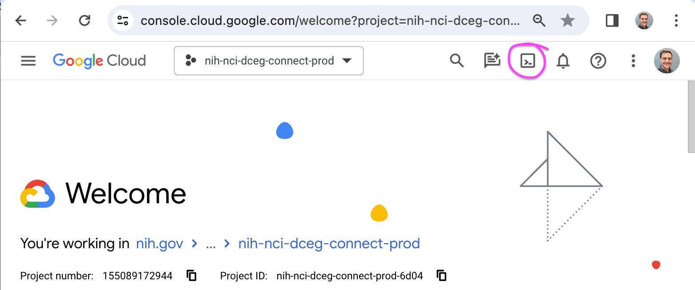

2. Set default project: 
<ul> ```gcloud config set project <paste-project-id>``` </ul> 
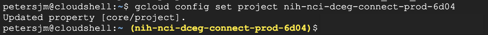

3. In second tab, 
    - **Open** `Cloud Run`
    - **Navigate** to service of interest (e.g., `ccc-weekly-report-api`)
    - **Click** the `REVISIONS` tab
    - **Copy** the `Image URL` from the panel at right 
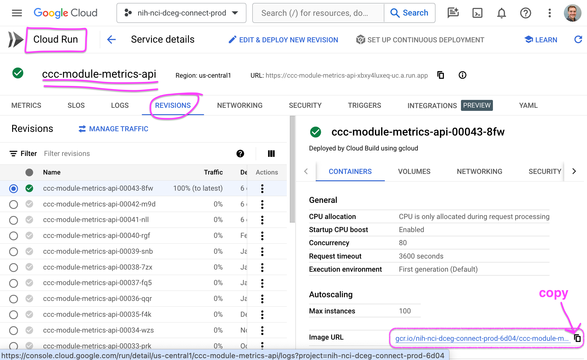

4. To pull the docker image in `Cloud Shell`, type 
<ul> ```docker pull <paste-image-url>``` </ul>
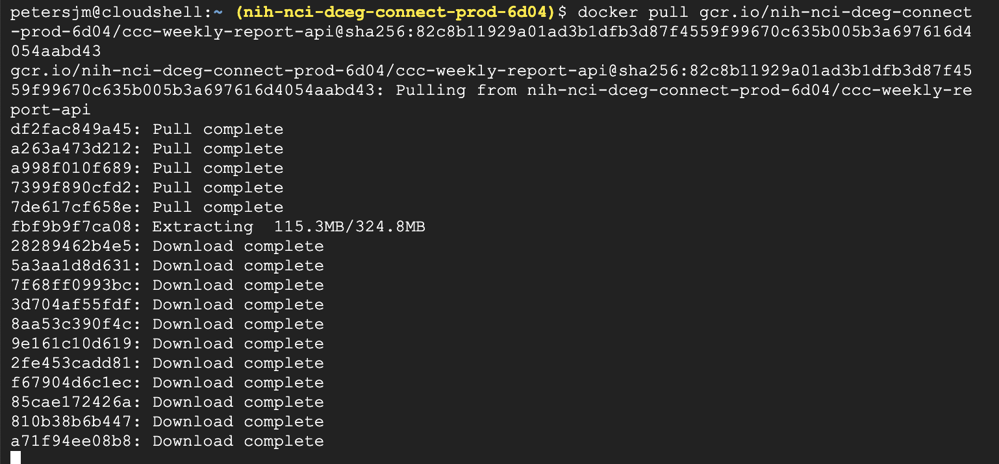

5. To confirm that the image is loaded, type: 
<ul>```docker image list``` </ul>
 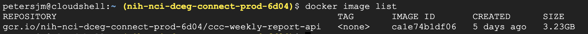

6. In seperate tab, **Navigate** to GitHub repo for pipeline and **Copy** the url.
 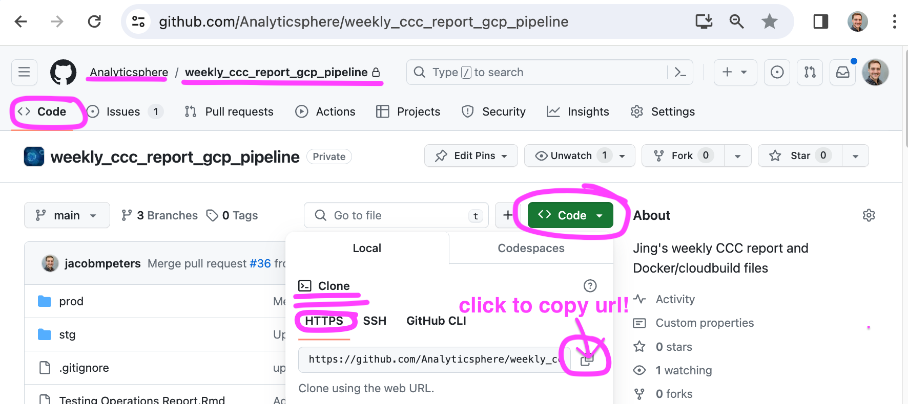

7. To clone the repo in the `Cloud Shell`, type: 
<ul> ```git clone <paste-gh-repo-url>```  </ul>
 Note that you will be prompted to use your github username and password in order to clone the repo. If your password fails, you will need to use a `personal access token` instead. <br>
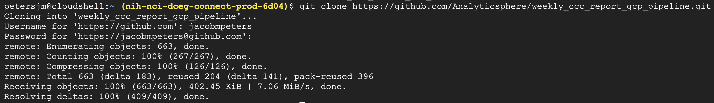

8. Explore the directory with `ls` and `cd` commands. You should now be able to see a `report.Rmd` file, a `cloudbuild.yaml` file, a `Dockerfile`, and a `plumber_api.R` file. The name of the R files will differ from pipeline to pipeline of course. <br>
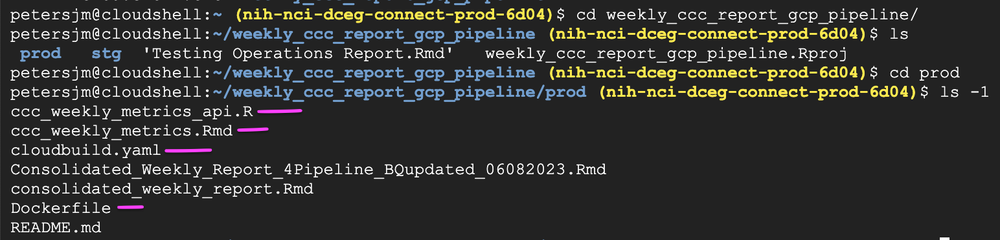

9. Once in the directory containing the `Dockerfile`, type: 
<ul>```docker build .``` </ul>
to build the container. This may take 5-15 minutes, depending on how many dependencies (e.g., R packages, pandoc) must be loaded.
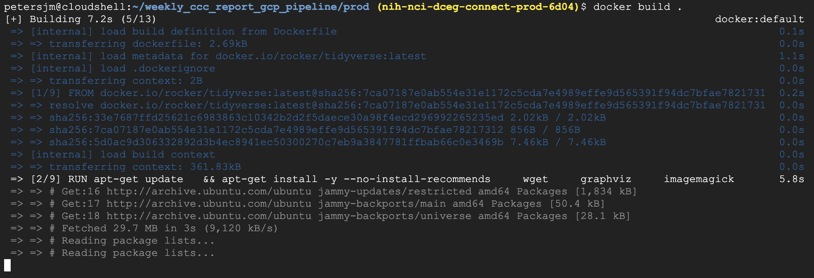

10. To see the image that was just built, type: 
<ul> ```docker image ls``` </ul>
You might see the image that was built by cloud build and the one that was just built manually from the github repo.
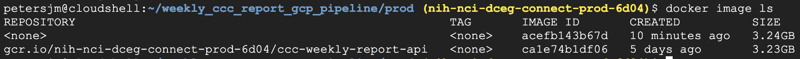

11. This is unnecessary, but if you would like to keep them straight, you can apply a `tag` to label them:
<ul> ```docker tag <image id> <repository_name>:<tag_name>``` </ul>
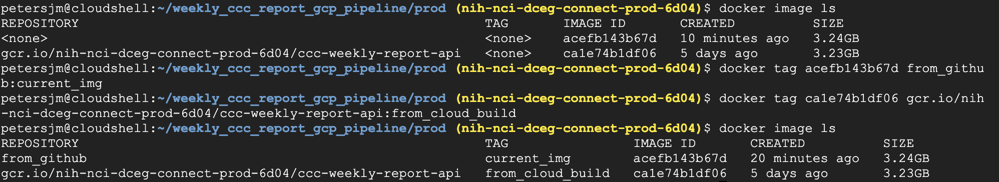
**Note** that the one I labeled `from_github:current_img` is the one that I build directly from the github repo. The one that called `gcr.io*:from_cloud_build` is the one that Cloud Build produced.

12. To enter the container, type:
<ul> ```docker run -it --env PORT=8080 /bin/bash <image id>``` </ul>
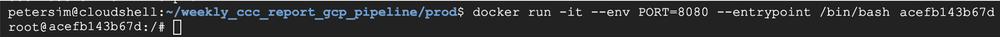

13. To execute a script for debugging, enter something like:
<ul> ```Rscript -e "bigrquery::bq_auth()"``` </ul>
<ul> ```Rscript -e "rmarkdown::render('report.Rmd')"```
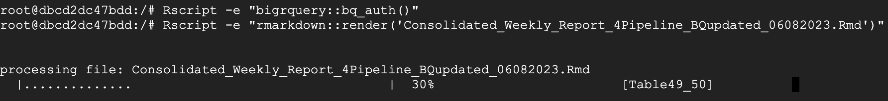

## Tips & Tricks:

- Get the latest docker image:
<ul> ``` IMAGE_ID=$(docker image ls -q | head -qn1) ``` </ul>
    - `docker image ls -q`: Lists Docker images and outputs only their IDs.
    - `head -qn1`: Takes the first line of the output, which corresponds to the ID of the latest image.
    - So, `IMAGE_ID` will store the ID of the latest Docker image.

- Run the latest docker container:
<ul>  ``` docker run -it --env PORT=8080 /bin/bash $IMAGE_ID ``` </ul>

- Consider configuring all of this workflow as a bash script for each pipeline that you would like to debug
